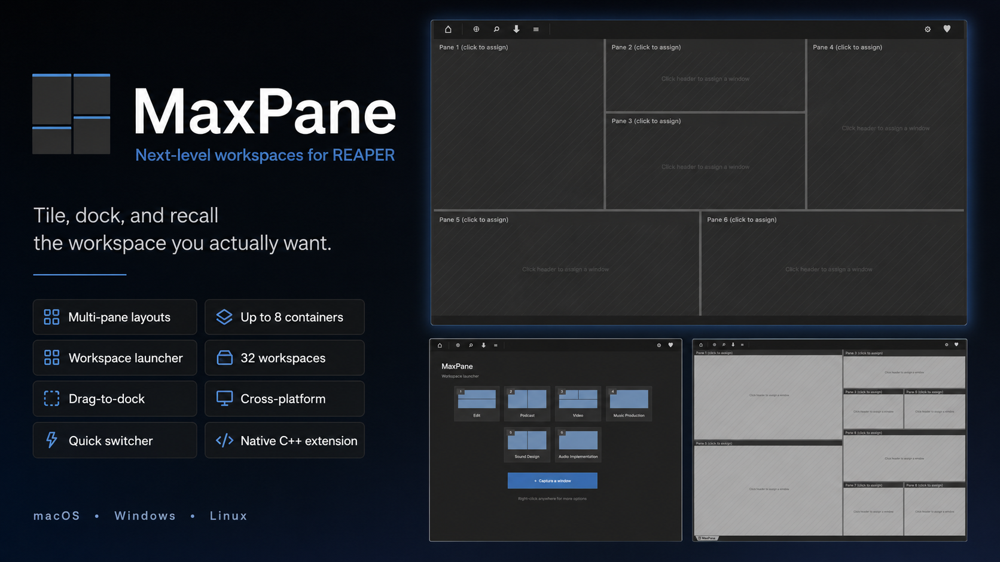
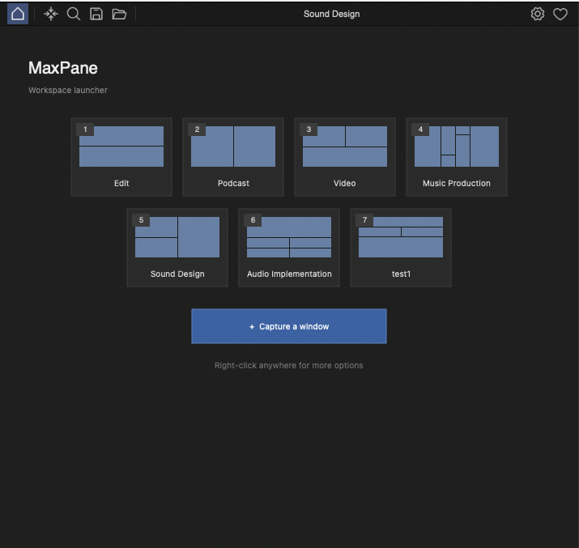
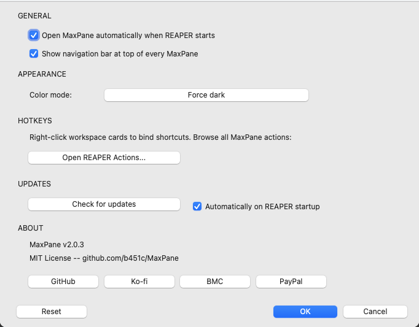
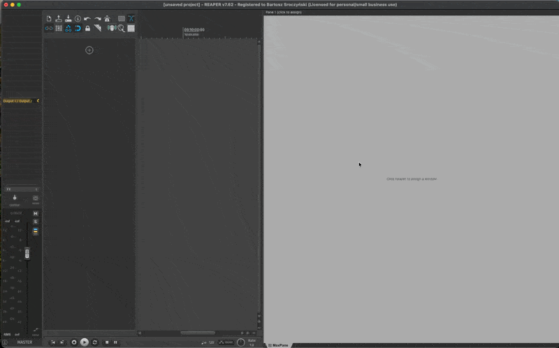
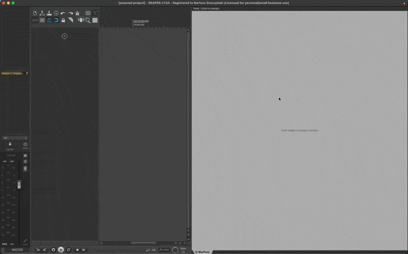
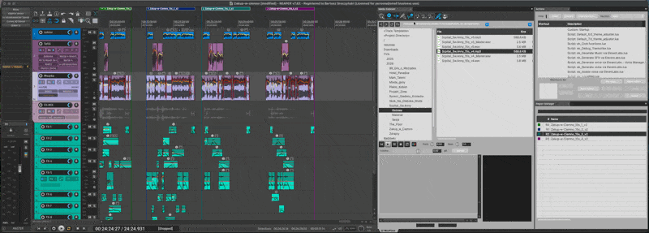

# MaxPane

[](LICENSE)
[](https://github.com/b451c/MaxPane/releases/latest)
[](#requirements)
[](https://github.com/b451c/MaxPane/actions/workflows/ci.yml)

**Nested docker layouts for REAPER** — a native C++ extension that turns any
REAPER window into a tile inside a multi-pane workspace. Up to 8 independent
containers, drag-to-dock from outside, 32 saved workspaces, hotkeys for
everything, Quick Switcher (Cmd+P-style), floating mode, and a launcher that
remembers your layouts.



> Capture any REAPER window — Media Explorer, FX Browser, Mixer, Actions,
> toolbars, or third-party ReaImGui scripts — into a tiling container with
> resizable splits, tabbed panes, and one-click workspace recall.

---

> **Release history** lives in [CHANGELOG.md](CHANGELOG.md) — latest:
> **v2.2.1** (Windows/Linux interaction parity, ReaImGui script windows
> resolved per platform, MIDI toolbar capture).

## Features

### Layout
- **Flexible split layouts** — split panes horizontally or vertically to any
  depth (up to 16 panes). Drag splitter bars to resize on the fly. Double-
  click any splitter to reset to 50/50.
- **Tabbed panes** — multiple windows per pane with a tab bar. Drag tabs
  between panes, reorder within a pane. Each tab bar has a **▼ menu** for
  pane operations.
- **Floating mode** — detach the whole container into a top-level window
  with native chrome. Multi-monitor positions remembered; always-on-top
  toggle for keyboard-monitor setups.
- **Solo / maximize** — temporarily expand any pane to fill the entire
  container; full tree restored on exit.
- **5 layout presets** — Two Columns, Left + Right Split, Three Columns,
  2x2 Grid, Top + Bottom Split.
- **Space savers** — the navigation bar collapses to a thin strip via its
  chevron, and single-window panes can auto-hide their tab bar (Settings)
  so the captured window gets every pixel.
- **Pinned tabs** — sticky tabs sorted to the left of each pane, exempt
  from "Close Others" / "Close All".
- **Tab colors** — color-code tabs with 8 palette colors. Reopen last
  closed tab, Close Others / to Right / All.

### Capture
- **Drag-to-dock** — grab any REAPER window from outside MaxPane and drop
  it on a pane. A live preview frames the exact drop zone (four split
  zones, tab bar, body center); Shift+drop replaces the active tab.
  Dragging a window by its title bar targets the pane under the window's
  body, so it just works.
- **Click-to-capture** — arm capture mode, hover any window (a blue
  outline shows exactly what a click will grab), click to dock it.
  Esc or right-click cancels. Safe around modal dialogs and REAPER's
  core edit views.
- **15 known REAPER windows** — one-click capture for Mixer, Track
  Manager, Routing Matrix, Media Explorer, FX Browser, Project Bay,
  Region Manager, Region Render Matrix, Actions, Undo History,
  Navigator, Big Clock, Video, Performance Meter, Virtual MIDI
  Keyboard.
- **Arbitrary window capture** — grab any visible REAPER window via the
  "Open Windows" submenu, click-to-capture, or drag-to-dock: toolbars
  (1–32 **and all MIDI toolbars**), third-party ReaImGui scripts
  (ReaBeat / ReaMD / reamix.me), managers, dockers.
- **AU / VST / JSFX plugin UI capture** — capture a floating plugin
  window; identity is saved as a `(track GUID, FX GUID)` pair so it
  round-trips through workspace save/load and project reopen as long as
  the matching project is loaded. See Known limitations below for the
  project-bound and plugin-scaling caveats.
- **Favorites** — pin frequently-used windows for instant access from any
  container's menu.

### Workspaces
- **32 saved workspace slots** — tree layout + captured windows snapshot.
  One click in the launcher or one hotkey binding to recall.
- **Workspace launcher** — an empty container shows a card grid of saved
  workspaces with mini layout previews. One click loads; right-click for
  Rename / Duplicate / Delete / Bind Hotkey.
- **Per-project state** — layout is saved inside each `.RPP` project file
  via REAPER's `project_config_extension_t`, so different projects can
  have different MaxPane configurations and they load with the project.
- **REAPER Window sets (screensets) integration** — MaxPane's layout
  round-trips through Window sets: recall a set and MaxPane restores its
  panes and re-captures its windows automatically.
- **Custom Save dialog** — name input + clickable list of existing
  workspaces + dynamic status label so you know whether you're creating
  new or replacing.

### Multi-instance
- **Up to 8 independent containers** per session. Each instance has its
  own layout, captured windows, floating geometry, and per-project
  state. Workspaces and favorites are shared across instances.

### Navigation + hotkeys
- **Persistent navigation bar** — Home, Drag-to-dock, Quick Switch, Save,
  Load▾, Settings, Support as a clean toolbar at the top of every
  container (collapsible; current workspace name + dirty indicator).
- **Quick Switcher** — fuzzy-match across open tabs / workspaces /
  favorites. Bind your own hotkey.
- **`MaxPane: Workspace pickup`** — single hotkey, prompt for slot
  number, load. One binding reaches all 32 slots.
- **`MaxPane: Reopen last closed tab`** — 16-entry per-container ring
  buffer; session-scoped.
- **Tab + pane keyboard nav** — Next/Prev Tab, Next/Prev Pane, Solo
  Toggle, all bindable in REAPER's Actions dialog.
- **Inline hotkey binding (v2.0.4+)** — workspace launcher right-click
  → "Bind hotkey" opens REAPER's native shortcut-edit dialog scoped
  to that specific slot (no need to filter through the full action
  list).
- **Accelerator hook** — MaxPane action bindings fire even when MaxPane
  (or a captured pane) has focus — v1.x required REAPER's main window
  to have focus first.
- **Settings + updates** — auto-open, nav bar, dark-mode override
  (auto / light / dark), default workspace, tab-bar collapse, support
  links; non-blocking update check on startup (toggleable).

### Platform
- **macOS arm64 + x86_64** — primary platform, actively tested on every release.
- **Windows x64** — supported and CI-built; capture and drag interactions
  verified live on Windows 11 for v2.2.0, ReaImGui script capture (TK
  Patchbay) verified live for v2.2.1. Community reports welcome.
- **Linux x86_64 + aarch64** — supported and CI-built; capture and drag
  interactions verified live on Ubuntu 24.04 for v2.2.0, ReaImGui script
  capture for v2.2.1 (see Known limitations for the X11 title-bar quirk
  and the ReaImGui software-rendering requirement). Community reports
  welcome.
- **Zero scripting / no dependencies** — pure C++ extension using REAPER
  SDK + WDL/SWELL. No `js_ReaScriptAPI`, no ReaImGui, no Lua.

---

## Screenshots

| Launcher hero | Settings dialog |
|:---:|:---:|
|  |  |

| Create grid layout | Assign windows to panes | Recall workspace |
|:---:|:---:|:---:|
|  |  |  |

---

## Installation

### ReaPack (recommended)

1. In REAPER, go to **Extensions → ReaPack → Import repositories…**
2. Paste this URL:
   ```
   https://raw.githubusercontent.com/b451c/MaxPane/main/index.xml
   ```
3. Go to **Extensions → ReaPack → Browse packages**, search for **MaxPane**.
4. Right-click → **Install**, then restart REAPER.

ReaPack will notify you of future updates automatically.

### Manual install

1. Download the binary for your platform from the
   [Releases](../../releases) page:
   - **macOS** — `reaper_maxpane-arm64.dylib` (Apple Silicon) or
     `reaper_maxpane-x86_64.dylib` (Intel) →
     `~/Library/Application Support/REAPER/UserPlugins/`
   - **Windows** — `reaper_maxpane-x64.dll` →
     `%APPDATA%\REAPER\UserPlugins\`
   - **Linux** — `reaper_maxpane-x86_64.so` (or
     `reaper_maxpane-aarch64.so`) → `~/.config/REAPER/UserPlugins/`
2. Copy it to the UserPlugins folder for your platform (above).
3. Restart REAPER.
4. Open via **Actions → MaxPane: Open Container**, or assign a keyboard
   shortcut.

---

## Quick start

1. **Open MaxPane** — run the action `MaxPane: Open Container` from
   REAPER's Actions menu.
2. **First time?** The launcher card grid is empty. Click any **▼ menu**
   button on a pane tab bar, or right-click any pane, to capture your
   first window. Or click `[Drag]` on the nav bar and drag a REAPER
   window from outside into the pane.
3. **Split panes** via the pane menu (Split Left/Right or Split
   Top/Bottom) or via drag-to-dock with an edge zone.
4. **Tabbed windows** — drop multiple windows on the same pane; click
   tabs to switch, drag tabs between panes to rearrange.
5. **Save a workspace** — click `[Save]` on the nav bar (or right-click
   → Save Workspace…). Name it; it shows up in the launcher next time.
6. **Recall a workspace** — when a container is empty, click its card.
   Or click `[Home]` to overlay the picker on top of your current layout
   without disturbing it.
7. **Bind a hotkey** — in REAPER's Actions dialog, search for
   `MaxPane: Workspace Slot 1` (etc.) or
   `MaxPane: Workspace pickup` (single hotkey for all 32 slots).

---

## Building from source

See [CONTRIBUTING.md](CONTRIBUTING.md) for the full workflow. Quick path:

```bash
git clone https://github.com/b451c/MaxPane.git
cd MaxPane
git clone https://github.com/justinfrankel/reaper-sdk.git cpp/sdk
git clone https://github.com/justinfrankel/WDL.git cpp/WDL

mkdir -p cpp/build && cd cpp/build
cmake .. -DCMAKE_BUILD_TYPE=Release
cmake --build . --parallel
```

Then copy the resulting `reaper_maxpane.{dylib,so,dll}` to your REAPER
UserPlugins directory (paths above).

Architecture, module map, the three SetParent paths, the
close-mechanism deep-dive, and the v2.0 feature surface — see
[ARCHITECTURE.md](ARCHITECTURE.md).

---

## Requirements

- **REAPER** 7.0+ (tested on 7.62, 7.68, 7.69, 7.73)
- **macOS** arm64 (Apple Silicon) and x86_64 (Intel) — primary platform,
  actively tested on every release
- **Windows** x64 — supported; built by CI for every release,
  runtime-verified less frequently than macOS — community reports welcome
- **Linux** x86_64 and aarch64 — supported; built by CI for every release,
  runtime-verified less frequently than macOS (validated on Ubuntu 24.04;
  FX Browser close crash from
  [#9](https://github.com/b451c/MaxPane/issues/9) no longer reproduces
  on REAPER 7.69 — covered by an upstream WDL/SWELL fix) — community
  reports welcome

---

## Known limitations

These are intentional design boundaries rather than bugs. Each release's
entry in [CHANGELOG.md](CHANGELOG.md) carries the details current for
that version.

- **Plugin restore needs the matching project open.** Track GUIDs +
  FX GUIDs are project-bound (REAPER itself stores them inside
  `.rpp` files). Workspace load reopens AU/VST UIs only when their
  owning tracks are present in a loaded project. Recommended workflow:
  open the project first, then load the workspace. For pure project-
  bound layouts, REAPER's RPP `<MAXPANE_STATE>` chunk auto-restores
  the layout on project reopen (save the `.rpp` after capture).
- **Container FX not yet supported.** Capturing the UI of an FX
  inside a REAPER 7.06+ container chain works at the time, but the
  identity isn't encoded in the workspace yet — re-add after restart.
  Top-level track FX and recFX (input FX) are fully supported.
- **FX moved between tracks won't auto-restore.** Strict track-GUID
  match; a toast surfaces "FX missing: …" so you know what skipped.
- **Pre-v2.0.4 workspaces need a one-time re-capture for plugin
  tabs.** Legacy `arb:0:<plugin name>` entries can't resolve to a
  live FX instance. Re-capture once, re-save. Non-FX tabs (Mixer,
  toolbars, scripts) restore as before.
- **Linux/X11: title bars belong to the window manager.** A bare click
  on a window's title bar can't always be attributed to that window
  (X11 reports no window at that point; MaxPane recovers most cases via
  a decoration-band fallback). When click-capturing or drag-docking on
  Linux, clicking the window's content always works.
- **Plugin window scaling is plugin-side.** Most VST/AU GUIs render
  at a fixed resolution and don't dynamically resize to fit the
  MaxPane pane. The plugin sits at its native size — surrounded by
  whitespace if the pane is bigger, cropped to the pane viewport if
  smaller. MaxPane reparents the OS window but cannot force the
  plugin framework to redraw at a different scale. Resize the pane
  to roughly match the plugin's preferred size, or use the plugin's
  own zoom control if it exposes one. Same limitation in REAPER's
  native FX float windows.
- **Linux: GL ReaImGui windows need software rendering to be captured.**
  Reparenting destroys the X11 window under the script's GL context, so
  MaxPane only captures these windows when ReaImGui's "Disable hardware
  acceleration" preference is on (Preferences → Plug-ins → ReaImGui);
  restart the script after enabling it. Otherwise the capture is refused
  with a message saying exactly that. LICE-based script windows (Lua
  `gfx`) are unaffected.
- **macOS: ReaImGui scripts that enforce a fixed minimum window size
  (e.g. TK Patchbay) can resize and move REAPER's main window** when
  captured into a pane smaller than that minimum. ReaImGui's macOS
  backend applies the script's size enforcement to the hosting window —
  which after capture is REAPER's own. Workaround: dock such scripts
  natively in REAPER's docker, or keep the MaxPane pane at least as
  large as the script's minimum. Scripts without size constraints
  (e.g. ReaMD) are unaffected.

---

## Contributing

Contributions welcome. Read [CONTRIBUTING.md](CONTRIBUTING.md) and
[ARCHITECTURE.md](ARCHITECTURE.md) first. CI runs the full 5-platform
matrix on every PR — your change has to be green there before review.

---

## Support development

MaxPane is MIT-licensed and free. If it saves you time, please support
its development:

- [Ko-fi](https://ko-fi.com/quickmd)
- [Buy Me a Coffee](https://buymeacoffee.com/bsroczynskh)
- [PayPal](https://paypal.me/b451c)

---

## License

[MIT](LICENSE) — Copyright (c) 2025–2026 b451c

## Links

- **Forum thread** — https://forum.cockos.com/showthread.php?t=307267
- **REAPER** — https://www.reaper.fm
- **ReaPack** — https://reapack.com
- **REAPER SDK** — https://github.com/justinfrankel/reaper-sdk
- **WDL / SWELL** — https://github.com/justinfrankel/WDL


---

Made by [falami.studio](https://falami.studio/lab/maxpane/) — audio production & engineering studio.
